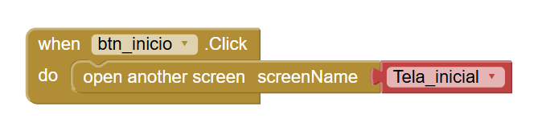
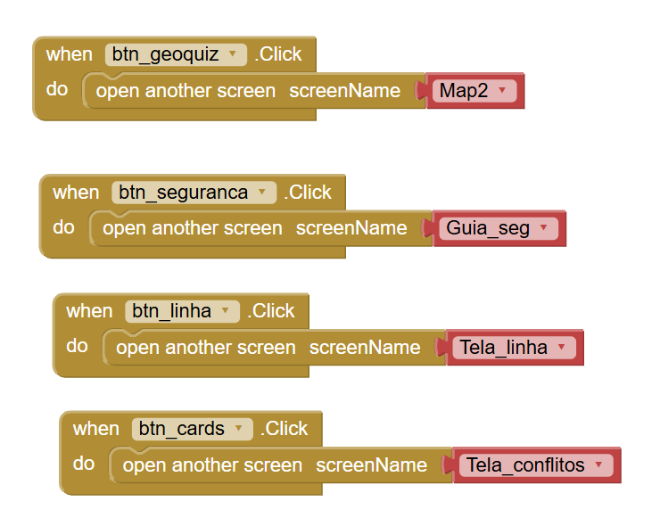
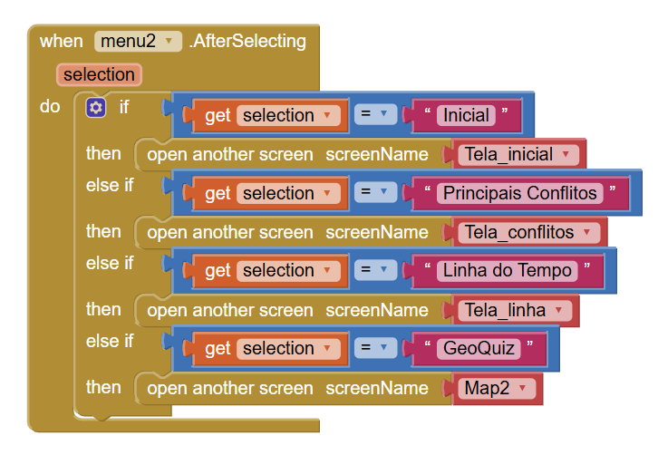
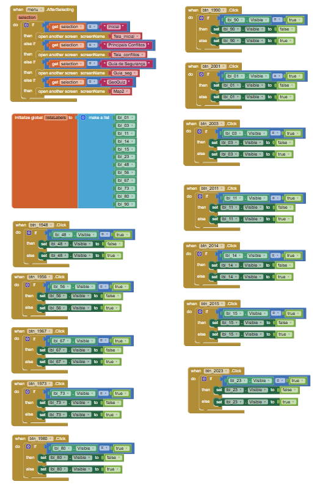
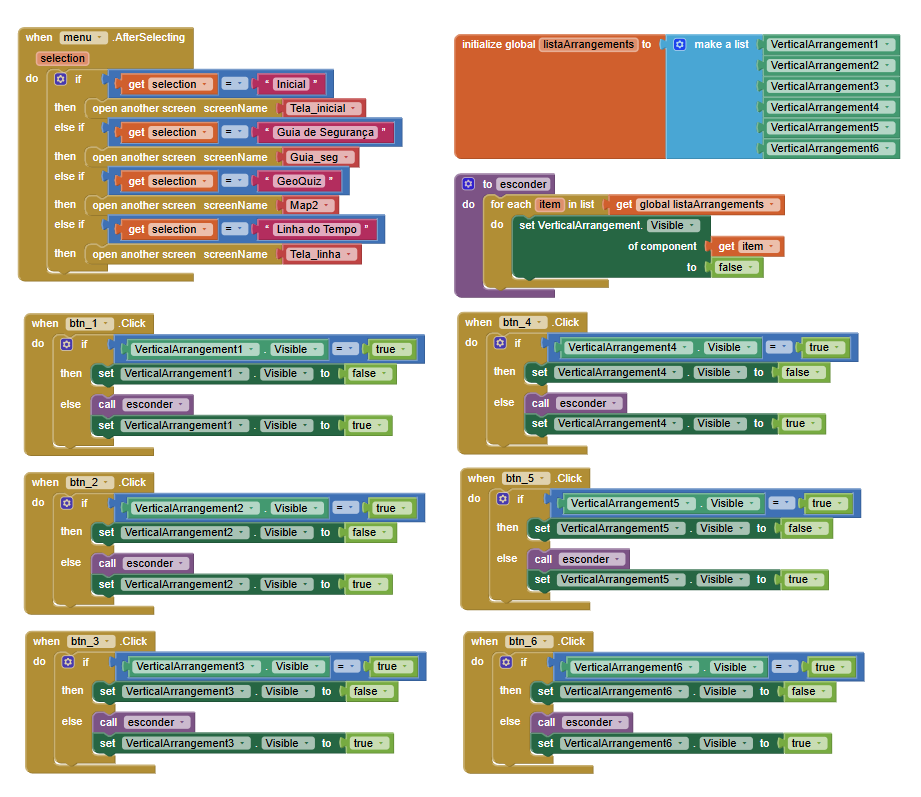
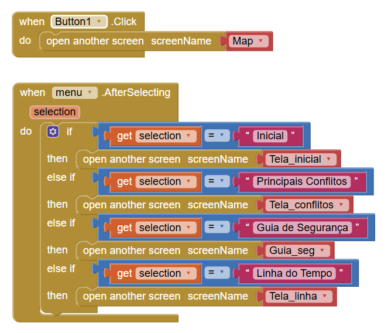
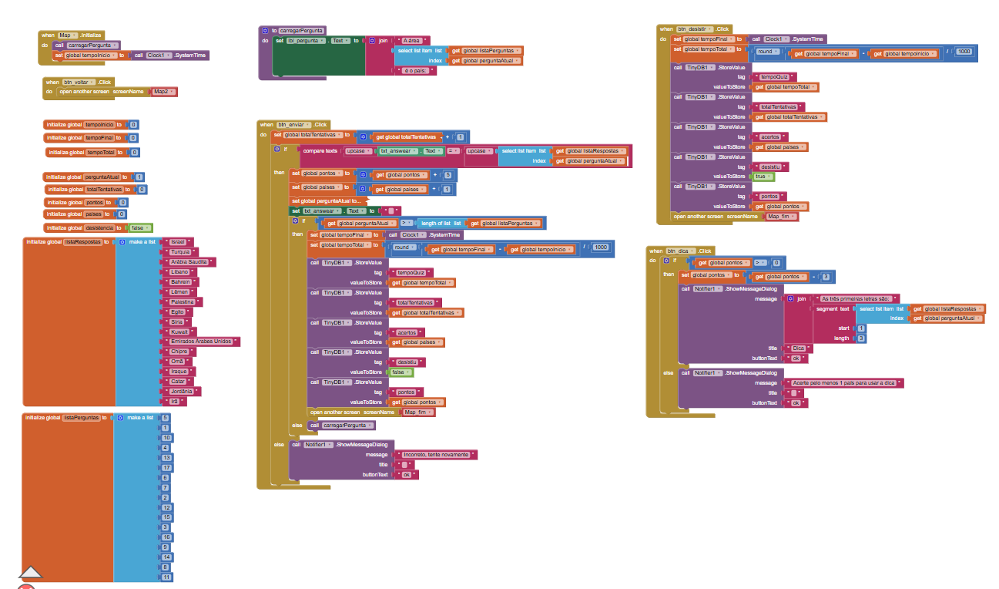
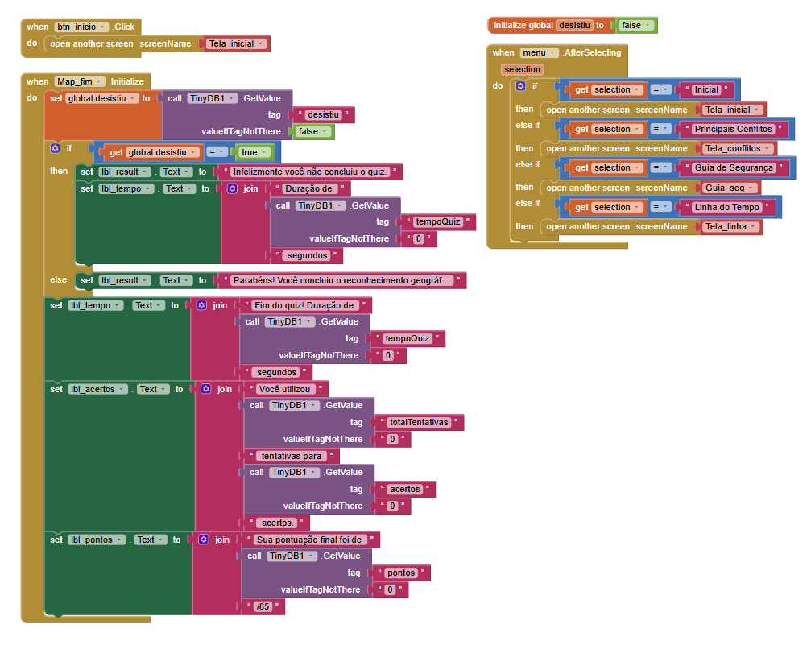

## Instituição
Etec Vasco Antonio Venchiarutti - Jundiaí SP

## Curso
Técnico em Desenvolvimento de Sistemas Integrado ao Ensino Médio

## Turma
2ºC1

## Autores
Henrique Silvestre Martin e Isabella Fernanda da Silva Barbosa

---

# 📱 Projeto

## Título
Guerras do Oriente

## Descrição

O nosso aplicativo tem como objetivo informar o usuário sobre os conflitos no Oriente Médio, apresentando conteúdos educativos como uma linha do tempo histórica, explicações dos principais conflitos e um guia de segurança baseado em recomendações da ONU, além de reforçar o aprendizado da geografia dessa região de forma prática por meio de um jogo interativo.

O aplicativo, ao ser acessado na tela 1, possui uma tela que apresenta o aplicativo e as opções de navegação. Essa tela apresenta as seções do aplicativo, que incluem:
- Guia de Segurança: As medidas básicas de segurança para civis em áreas de guerra recomendadas pela ONU divididas em “O que fazer em uma emergência” e “Protocolos de Abrigo” e um “Checklist de Emergência” com itens recomendados para se manter em um contexto de guerra.
- Linha do Tempo: Linha visual com os anos que marcaram os principais acontecimentos do Oriente Médio a partir da Segunda Guerra Mundial.
- Principais Conflitos: Cards que detalham os 6 principais conflitos dessa região.
- GeoQuiz: Jogo que testa seus conhecimentos ao relacionar áreas no mapa com os países do Oriente Médio.

A tela “Guia de Segurança” exibe as informações e permite que o usuário “marque” os itens que ele já possui caso haja contexto de guerra. 

A tela “Linha do Tempo” possibilita ao usuário o clique em cada ano para que ele visualize o principal acontecimento do determinado ano, exibindo, caso o usuário clique em todos os anos, uma linha completa com os 12 anos mais importantes para a história do Oriente Médio.

A tela “Principais Conflitos” possui 6 botões com os principais conflitos e permite ao usuário o clique – em apenas um por vez – no botão para visualizar um resumo do conflito selecionado.

A tela inicial do “GeoQuiz” possui uma prévia do mapa com as identificações dos países por números, uma breve explicação da importância de conhecer a geografia de uma região, a explicação de como o jogo funciona e quais os países presentes no mapa, com ao fim, um botão para iniciar o jogo. O jogo funciona da seguinte maneira: o usuário observa o número exigido na pergunta e identifica o país correspondente àquela posição no mapa digitando-o corretamente no campo de texto. Ao clicar no botão “Enviar”, o aplicativo valida a resposta e só permite prosseguir em caso de acerto, além de exibir uma mensagem caso a resposta esteja incorreta. O botão "Dica", disponível apenas após pelo menos um acerto, fornece as três primeiras letras da resposta correta, reduzindo 3 pontos da pontuação final. Caso o usuário queira encerrar o quiz sem completá-lo, o botão "Desistir" finaliza o jogo e o direciona diretamente para a tela de encerramento do jogo, que exibe suas informações até a desistência. A tela de finalização exibe a mensagem de parabéns pelo reconhecimento geográfico caso o usuário conclua o quiz, além de informações sobre seu desempenho: a duração do quiz, qual o total de tentativas em relação aos acertos e a pontuação final. 

Vale ressaltar que cada tela possui um menu no canto superior esquerdo, indicando as opções de navegação disponíveis a partir daquela tela – ou seja, a tela do guia de segurança possui em seu menu apenas as opções de início, linha do tempo, principais conflitos e geoquiz.

Os conceitos utilizados da apostila são:
- Eventos (clique de botão, envio de resposta),
- Manipulação de telas (troca entre screens),
- Design eficiente (uso de arrangements),
- Design agradável (cores de fundo e do texto para personalização).

Foram utilizados componentes de diversas seções oferecidas, como user interface, layout, sensors e storage, estando entre eles:
- TextBox: entrada de respostas do usuário;
- CheckBox: seleção pelo usuário;
- Button: envio de respostas e navegação;
- Label: exibição de textos explicativos e resultados;
- Image: imagens sobre o tema;
- Spinner: menu com opções de navegação;
- Arrangements: incluindo o Scroll Arrangement, permitiram melhor organização dos componentes;
- Notifier: mensagens importantes no jogo, como o erro e a não utilização da dica;
- Clock: armazenamento do tempo de quiz;
- TinyDB: armazenamento de informações entre as telas do jogo;
- Screens: organização do app em múltiplas telas.

Em relação aos recursos de lógica, vale a pena enfatizar a utilização de variáveis globais, procedimentos, estruturas condicionais (if, else if, else), bem como o sensor de tempo e o componente de armazenamento tinydb.

Em comparação com os modelos da apostila, é possível identificar diversas ideias novas aplicadas no aplicativo, como:
Adição de tempo de duração do quiz com um sensor;
Sistema de pontuação e feedback em tempo real conforme o usuário interage com o aplicativo;
Botão de encerrar o jogo, alterando o comportamento da tela final;
Uso de variáveis para armazenar pontuação, tempo, respostas;
Uso de listas para o sistema de perguntas e respostas e a exibição de arrangements conforme a intenção do usuário;
Ocultação da visibilidade de componentes para promover maior interação entre usuário e aplicativo.

## 🖥 Print das telas do Design

Screen1

Tela inicial

Guia de Segurança

Linha do Tempo

Principais Conflitos

GeoQuiz

Exemplo Menu do Guia de Segurança

## 🧩 Print das telas dos Blocos

Screen 1

Tela inicial

Guia de Segurança

Linha do Tempo

Principais Conflitos

GeoQuiz (início, quiz e fim)

